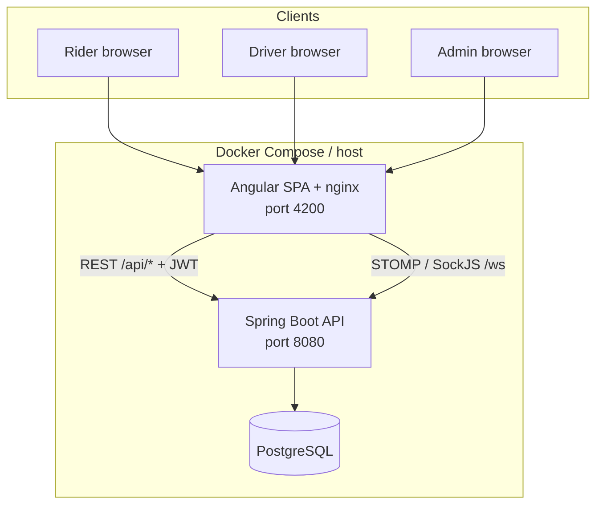
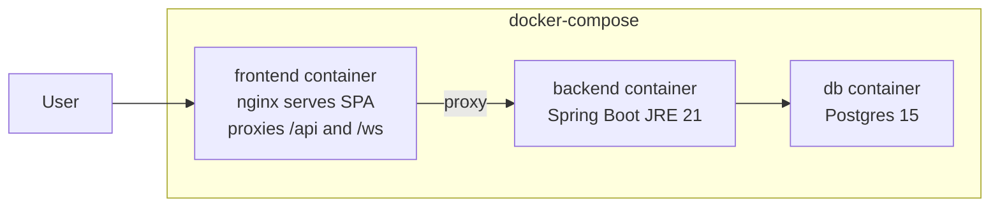
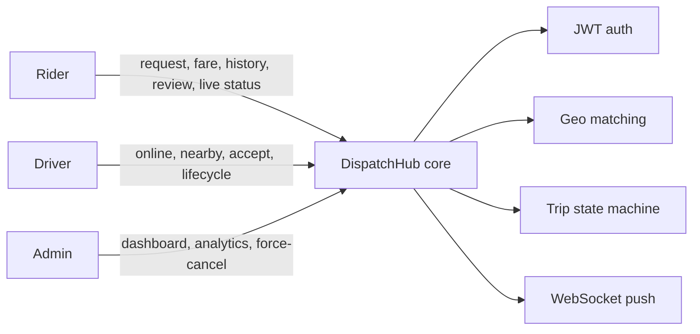
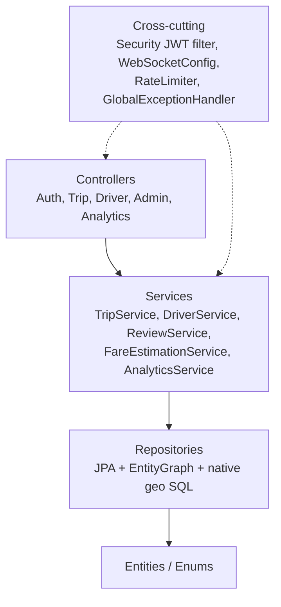
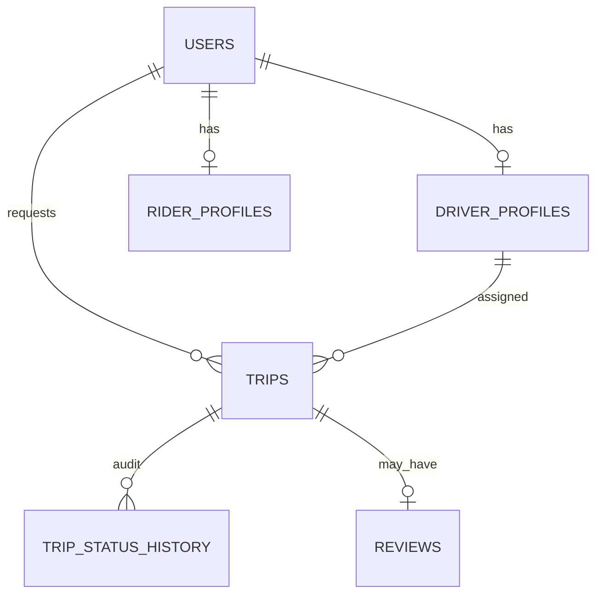
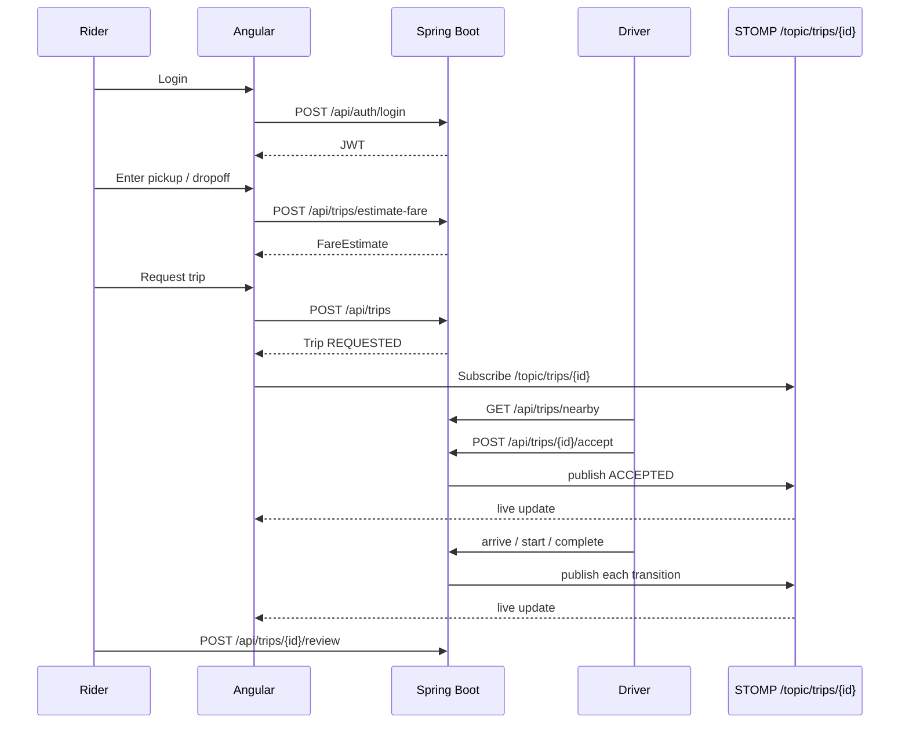
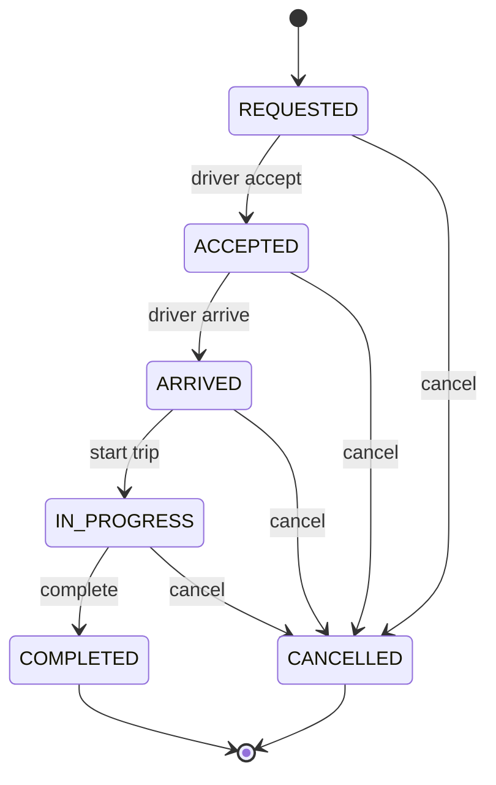

# DispatchHub - Ride Dispatch and Driver Matching System

CredX Hiring Hackathon 2.0 Round 2 submission by Team UnityNimit.

DispatchHub is a ride-hailing dispatch core modeled on Uber-style trip flow. Riders request trips, drivers accept nearby work, fares are estimated server-side, trip state advances through a defined lifecycle, and admins monitor operations from a dashboard.

**Stack:** Java 21, Spring Boot 3.3, JWT, Spring Data JPA, PostgreSQL, Angular 20 (standalone), Angular Material, STOMP/SockJS WebSockets, Docker Compose.

**Roles:** RIDER, DRIVER, ADMIN

**Trip lifecycle:** `REQUESTED -> ACCEPTED -> ARRIVED -> IN_PROGRESS -> COMPLETED` (plus `CANCELLED` from non-terminal states)

---

## Table of contents

1. [Bugs and issues we found and fixed](#1-bugs-and-issues-we-found-and-fixed)
2. [Extra features and improvements](#2-extra-features-and-improvements)
3. [High-level design (HLD)](#3-high-level-design-hld)
4. [Low-level design (LLD)](#4-low-level-design-lld)
5. [Request and realtime flows](#5-request-and-realtime-flows)
6. [Quick start (Docker)](#6-quick-start-docker)
7. [Manual setup](#7-manual-setup)
8. [Test accounts](#8-test-accounts)
9. [Further docs](#9-further-docs)

---

## 1. Bugs and issues we found and fixed

The baseline codebase was intentionally incomplete. These were the main correctness and security problems we reproduced and fixed.

| Issue | How it showed up | Fix |
|-------|------------------|-----|
| Haversine used degrees as radians | Distances and fare estimates were wrong for longer trips | Convert degrees to radians in `GeoUtils` before `sin` / `cos` |
| Cancel without ownership checks | Any authenticated user could cancel another user's trip | Enforce rider / assigned driver / admin rules in `TripService` |
| Accept race condition | Two drivers could accept the same trip under concurrency | `PESSIMISTIC_WRITE` (`SELECT FOR UPDATE`) on the trip row; optimistic `@Version` on driver profile |
| Trip detail readable by anyone logged in | `GET /api/trips/{id}` did not verify ownership | Admin can view any trip; rider only own trips; driver only assigned trips |
| Fare estimate UI not reactive | Estimate did not update cleanly as the rider edited coordinates | RxJS `valueChanges` + `debounceTime` + `switchMap` on the request-ride form |
| Phone validation too strict | Valid local phone numbers failed registration | Accept E.164 or common local formats on `RegisterRequest` |
| Analytics loaded all trips into memory | Dashboard / driver stats would not scale | JPQL aggregation (`GROUP BY` / `SELECT NEW`) in PostgreSQL |
| List endpoints caused N+1 selects | Extra queries per row for rider / driver associations | `@EntityGraph` joins on trip and driver list queries |
| Dashboard used `.size()` on loaded entities | Unnecessary memory and query cost for counts | Repository `countBy*` queries |
| Docker frontend called wrong API host | Login failed in Compose UI (`localhost:8080` vs nginx proxy) | Production `fileReplacements` to relative `/api` and `/ws` |

---

## 2. Extra features and improvements

### Product features completed

- Nearby drivers (`GET /api/drivers/nearby`) with Haversine distance
- Nearby open trips for drivers (`GET /api/trips/nearby`)
- Driver incoming-request inbox (nearby REQUESTED trips + accept)
- Rider trip history UI (`GET /api/trips/my`)
- Reviews after COMPLETED trips (ownership, one review per trip, rating recalculation)
- Admin force-cancel for stuck trips
- Reactive fare estimation on the booking form

### Scalability and reliability

- Bounding-box prefilter + native SQL Haversine for geo queries
- Geo-oriented indexes (`docs/SCALABILITY-INDEXES.sql`)
- Per-rider sliding-window rate limit on `POST /api/trips` (5 requests / minute, HTTP 429). In-memory for a single JVM; Redis would be the multi-instance follow-up
- Pessimistic locking on accept for concurrency safety

### Realtime

- STOMP over SockJS (`/ws`) for live trip detail updates
- Backend publishes only after trip mutations (`publishTripUpdate`), not on read-only mapping
- Frontend `TripRealtimeService` replaces interval polling on the trip detail page
- Driver inbox still uses short HTTP polling by design scope

### Packaging

- One-command boot: Postgres + backend + nginx frontend via Docker Compose
- Frontend image builds with `--legacy-peer-deps` and production environment URLs

---

## 3. High-level design (HLD)

System context: browser clients talk to the Angular SPA. The SPA calls the Spring Boot API over HTTPS/HTTP and opens a WebSocket for live trip status. The API persists domain data in PostgreSQL.



### Deployment view



### Capability map by role



---

## 4. Low-level design (LLD)

### Backend layering



### Trip accept concurrency (LLD)

```mermaid
sequenceDiagram
  participant D1 as Driver A
  participant D2 as Driver B
  participant API as TripService
  participant DB as PostgreSQL

  D1->>API: POST /trips/{id}/accept
  D2->>API: POST /trips/{id}/accept
  API->>DB: SELECT trip FOR UPDATE (pessimistic)
  Note over DB: Second accept waits on row lock
  API->>DB: status=ACCEPTED, assign driver, save
  API-->>D1: 200 TripResponse + WS publish
  API->>DB: lock released; second txn sees not REQUESTED
  API-->>D2: 409 / conflict (invalid state)
```

### Key backend modules

| Module | Responsibility |
|--------|----------------|
| `TripService` | Lifecycle transitions, ownership (`assertCanView` / `assertCanCancel`), WS publish after mutations |
| `FareEstimationService` | Distance and fare calculation (uses fixed Haversine) |
| `DriverService` | Online/offline, location, nearby drivers |
| `ReviewService` | Post-trip reviews and rating updates |
| `AnalyticsService` | Dashboard counts and aggregated driver stats in SQL |
| `TripRequestRateLimiter` | Per-rider request throttle |
| `WebSocketConfig` | STOMP broker `/topic`, SockJS endpoint `/ws` |
| `JwtAuthenticationFilter` | Stateless HTTP authentication |

### Frontend structure

| Area | Responsibility |
|------|----------------|
| `core/services` | HTTP clients, auth state, `TripRealtimeService` |
| `core/guards` | Auth and role route guards |
| `features/auth` | Login / register |
| `features/trips` | Request ride, detail (WS), history, lists |
| `features/drivers` | Status, incoming requests |
| `features/admin` | Dashboard, force-cancel actions |

### Domain model (simplified)



Full ER detail: [`docs/ER-DIAGRAM.md`](docs/ER-DIAGRAM.md)

---

## 5. Request and realtime flows

### Happy-path trip flow



### Trip state machine



### Auth flow (HTTP)

1. Client calls `POST /api/auth/login` or `/register` and receives a JWT.
2. Later HTTP calls send `Authorization: Bearer <token>`.
3. `JwtAuthenticationFilter` validates the token and sets `UserPrincipal`.
4. Method security (`@PreAuthorize`) plus service-level ownership checks enforce access.
5. WebSocket clients may send the same header on connect; HTTP APIs remain the primary auth boundary.

---

## 6. Quick start (Docker)

Requires Docker and Docker Compose.

```bash
docker compose up --build
```

- Frontend: http://localhost:4200
- Backend API: http://localhost:8080/api

If host port 8080 is already in use, map the backend to another host port in `docker-compose.yml` (for example `8081:8080`). The SPA still talks to `/api` through nginx.

---

## 7. Manual setup

### Prerequisites

- Java 21 (JDK)
- Maven 3.9+
- Node.js 20+ and npm 10+
- PostgreSQL 15+

### Database

```sql
CREATE DATABASE dispatchhub;
CREATE USER dispatchhub WITH PASSWORD 'dispatchhub';
GRANT ALL PRIVILEGES ON DATABASE dispatchhub TO dispatchhub;
```

### Backend

```bash
cd backend
mvn spring-boot:run
```

API: http://localhost:8080 (seeded on first boot via `DataLoader`)

### Frontend

```bash
cd frontend
npm install --legacy-peer-deps
npm start
```

App: http://localhost:4200 (dev config uses `http://localhost:8080/api`)

---

## 8. Test accounts

Seeded on empty database:

| Role | Email | Password |
|------|-------|----------|
| Admin | `admin@dispatchhub.com` | `Admin123!` |
| Rider | `rider1@dispatchhub.com` | `Rider123!` |
| Driver | `driver1@dispatchhub.com` | `Driver123!` |

You can also register new accounts from the UI.

---

## 9. Further docs

- [`docs/API-DOCUMENTATION.md`](docs/API-DOCUMENTATION.md) - endpoint reference
- [`docs/DATABASE-SCHEMA.sql`](docs/DATABASE-SCHEMA.sql) - schema
- [`docs/ER-DIAGRAM.md`](docs/ER-DIAGRAM.md) - entity relationships
- [`docs/SCALABILITY-INDEXES.sql`](docs/SCALABILITY-INDEXES.sql) - geo / status indexes
- [`docs/FOLDER-STRUCTURE.md`](docs/FOLDER-STRUCTURE.md) - project layout
- [`postman/`](postman/) - Postman collection

### Known follow-ups (not blocking demo)

- Full STOMP channel authentication beyond connect headers
- Multi-instance rate limiting (Redis)
- Push updates for driver inbox (still polled)
- Optional enhancements: geocoding, dynamic surge, refresh tokens, deeper integration tests
